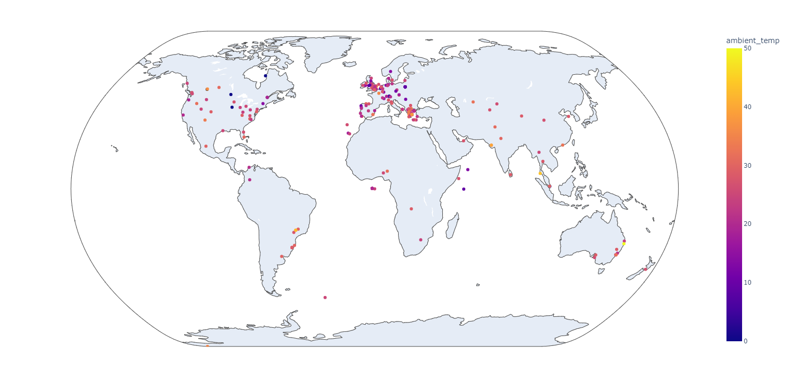

## Initial Step towards Geoplotting project

This basic script refreshes the following:
* Fetch data using a RESTful API
* Produce a variety of maps using the Python plotly library
* Plot data points on a map

One thousand weather stations were sent out all over the world at the beginning of 2016, ready to be assembled and begin collecting global weather data. The weather stations continually monitor the environment and send their data to an Oracle database, where it is stored and from which it can be accessed.

#### End Result:
