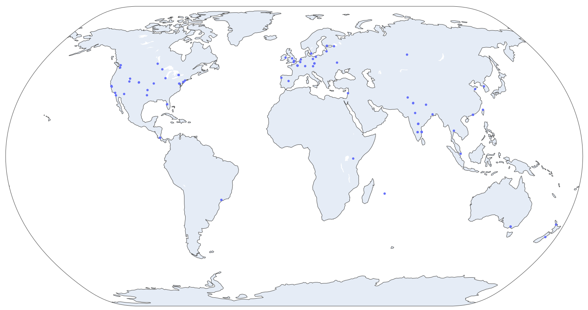

## Wikipedia Anonymous Edits Geo-Plot
Visualize anonymous edit locations for a given Wikipedia link.

## Setup
- Configure your [IPInfo API](https://ipinfo.io/) Token in the `config.json` file.
- To avoid unnecessary IP to Geolocation requests, caching is enabled. Already requested IP-Geolocation mapping is stored in `geolocation_cache.csv` - the path which is editable in `config.json`

## End Result:
This is plot of edit locations on [Web Scraping](https://en.wikipedia.org/wiki/Web_scraping) wiki page
